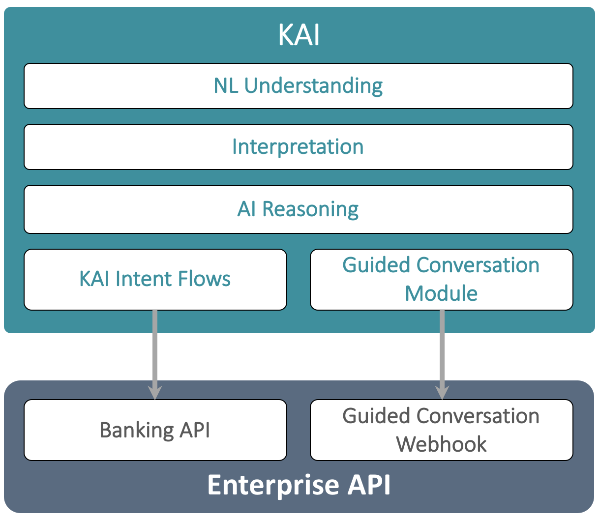
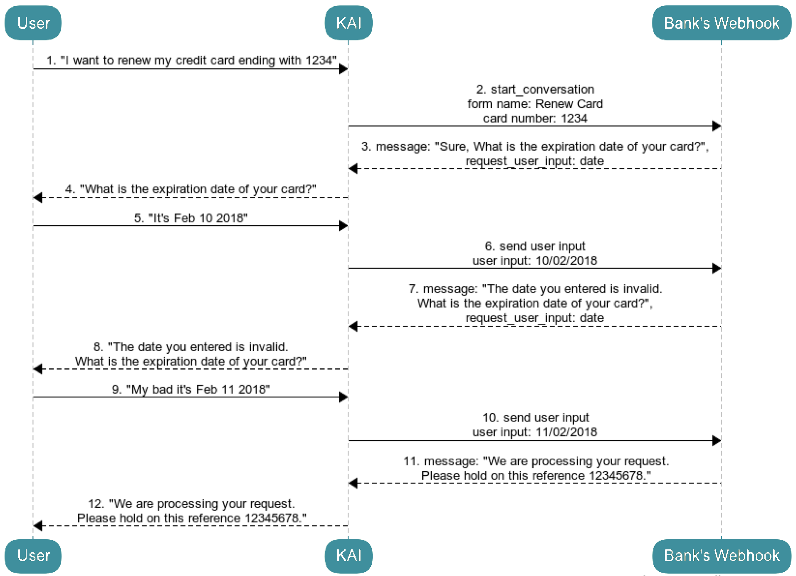

# Kasisto Dynamic Guided Conversations Flow Overview

### Version information
*Version* : 0.9 alpha 1

### Contact information
*Contact* : Kasisto  
*Contact Email* : info@kasisto.com

# Overview

Dynamic Guided Conversations are simple conversation that can be added to KAI. The main difference between traditional intents is that KAI delegates the execution of the conversation to a Server component called *Guided Conversation Webhook*. During the conversation, this Webhook takes over to orchestrate the interactions with the user. It uses KAI as a NLU processing engine and to process other requests such as FAQs or other intents implemented by KAI.

*TODO:* Add section and flow that describes how GC interacts with other intents For example:
When a form is submitted to KAI it is possible to add support for *Out-of-Form* questions. The form author may decided, for example, to allow access to certain intents, say account information so they can access balances or other properties of their accounts. This mechanism can also be used to enable FAQs to be active during a form, thus enabling users to learn more about the form or other products while they are in the process of completing the form. The default mechanism for out-of-form questions is to re-ask the last form question after the out-of-form intent responds. Thus a form author should not enable multi-turn intents (e.g. paying a person or transfering money) within a form. Learn more about out-of-form support in section 6 of the Guided Forms documentation.

*TODO:* Add section on how to support multilingual. For example:
It should be noted that Server's implementing Webhooks are responsible for supporting internationalization when interpreting results as well as generating user outputs through NLG. The header parameter *locale* can be used to distinguish different locales before generating a response.

## Flow

The following sequence diagram illustrate a sample Dynamic Guided Conversation.

1. The user tells KAI "I want to renew my credit card ending with 1234"

2. KAI understands that the user wants to trigger a Dynamic Guided Conversation.
Using its knowledge, KAI identifies the form to trigger as "Renew Card" and the card number specified by the user.
KAI invokes the Server's Guided Conversation Webhook to start a new conversation.

3. The Server's Webhook initiates the form input and process the provided data.
The card number is valid for this user and the form detects that it also needs the expiration date of the card.
The Webhook builds a question for the user "Sure, What is the expiration date of your card?" and asks KAI to capture another parameter that is a date.

4. KAI pushes the message to the User.

5. The user answers the question with "It's Feb 10 2018".

6. KAI detects that the input contains a date as expected and sends the date to the Server's Webhook.

7. The Server's Webhook validates that the date is correct. As the date is incorrect, the Webhook asks for the date again and builds a new message for the user: "The date you entered is invalid. What is the expiration date of your card?"

8. KAI push the message to the User.

9. The user answers the question with "My bad it's Feb 11 2018"

10. KAI detects that the input contains a date as expected and sends the date to the Server's Webhook.
 
11. The Server's Webhook verifies the date and this time it is valid. At this stage, all the required data is captured. The Webhook process the request and informs KAI that the form input is complete with a message to the user.

12. KAI displays the completion message to the User and the flow is complete.

*TODO:* Add flow showing an interaction of a guided form being interrupted by an existing intent.

### A. Conversation Triggers 
For Guided Conversations, the triggers are defined in KAI. For each conversation, KAI is trained to understand different types of Sentences. 
The Sentence can be a simple trigger or it can contain additional *slots*.
- "*I want to renew my card*" is a simple trigger to a conversation to activate a card.
- "*I need to renew my card* **ending with 1234**" is the same trigger with an additional contextual slot, the requested *card last 4 digits*
- "*renew my card expiring* **today**" is another trigger with the requested *expiration date* 

For this sample conversation, KAI would be trained with the following form:
- **form name** : Renew Card
- **form sample sentences** :
    + "I want to renew my card",
    + "I need to renew my card *{@card_number 5532}*",
    + "renew my card expiring *{@expiration_date on Tuesday}*",
    + "renew card expiring *{@expiration_date next month}*",
    + "can I renew my card?",
    + "renew my card *{@card_number 3321}* expiring *{@expiration_date tomorrow}*",
- **form optional slots** :
    + **field 1** :
        * **name** : card_number
        * **type** : number
    + **field 2** :
        * **Name** : expiration_date
        * **Type** : date

### B. Integration with the Server's Webhook
When KAI identifies a trigger and capture the *slot* details (all slots are optional), KAI initiates the Dynamic Guided Conversation with the Server's *Guided Conversation Webhook*.

The Webhook should implement the following services:
- **start conversation** : service used by KAI to initiate a new conversation between the User and the Webhook.
- **send user input** : service used by KAI to send the User input to the Webhook when a value is received.

More details on the services is available in the [Webhook API Overview](api-overview.md).

